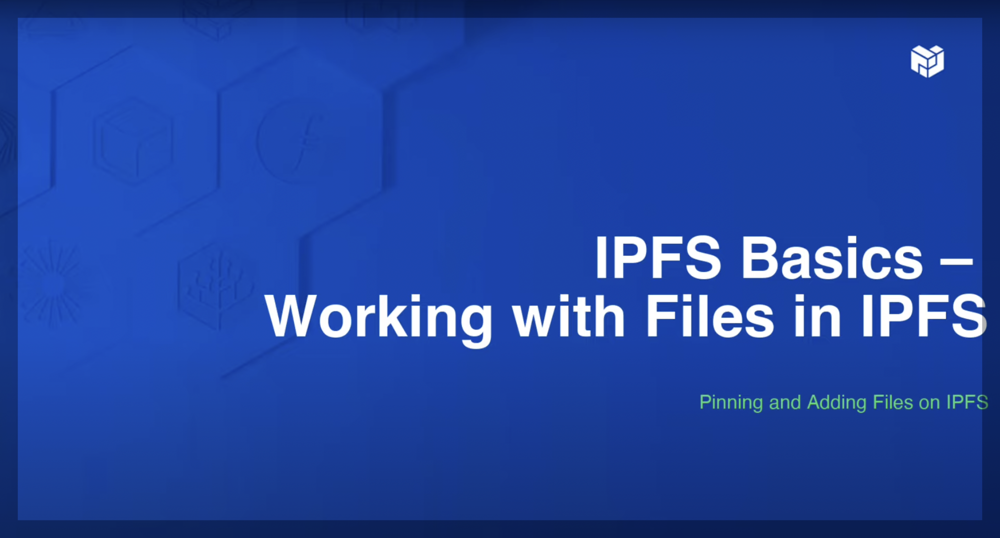

## Deposit
https://docs.google.com/spreadsheets/d/13EYQlbR21EInNFw8eeWh_979qMzQ3_VGR898EAWdkeU/edit?usp=sharing

## Objectives
- Understand the pros and cons of the BitTorrent, IPFS, Filecoin, and Arweave protocols.
- Be able to deploy files on these protocols and understand how the files and data are saved.
- Be able to create your first decentralized website/application.

## Torrent

### Background

BitTorrent is a leading software company with popular torrent client software for Windows, Mac, Android, and more. The protocol was designed in 2001 by Bram Cohen, and it has since become one of the most common protocols for transferring large files. BitTorrent breaks down large files into small pieces, which are distributed across a network of computers. As you download a piece, you also start uploading it to others, making the distribution faster as more users download the file.

## Requirements
- Node.js 18 or higher

### Instructions
#### Download the Torrent package.

This package allows you to interact with the BitTorrent network directly from your command line.
```bash
npm install -g torrent
```
#### Check installation.

Ensuring the tool is correctly installed helps avoid any unnecessary troubleshooting later.
```
torrent --version
```
#### Torrent commands.

These commands allow you to interact with the BitTorrent network, including downloading, creating, seeding, and inspecting torrents.
```
torrent <magnet link OR path to .torrent file>

  Download a torrent from a magnet link or torrent file.

torrent create <directory OR file> {-o outfile.torrent}

  Create a torrent file from a directory or file.

  If an output file isn't specified with `-o`, the torrent file will be
  written to stdout.

torrent seed <torrent file>

  Seed a torrent file.

torrent info <torrent file>

  Print information about a .torrent file to stdout as JSON.
```

### Questions
- Q1 - Create a torrent containing [this image](https://cdn.futura-sciences.com/sources/images/Chaton.jpeg).
- Q2 - Now copy the image to a new directory named `partition1` and create a torrent of this folder. What do you observe?
- Q3 - Copy the `partition1` folder and then generate the associated torrent. What do you observe?

## IPFS

### Context
The InterPlanetary File System (IPFS) represents an ambitious attempt to rearchitect the web, aiming to address some of the core limitations of the traditional HTTP protocol through decentralization. Developed by Juan Benet, IPFS introduces a peer-to-peer method of storing and sharing files in an effort to make the web more resilient and efficient. By distributing data across a global network of nodes, IPFS seeks to reduce reliance on centralized servers, potentially mitigating risks associated with censorship and server outages.

### Installation

Install IPFS CLI and IPFS Desktop client.

<details>
    <summary>
        Install the IPFS Desktop App
    </summary>

**IPFS Desktop bundles an IPFS node, file manager, peer manager, and content explorer into a single, easy-to-use application.**

Use IPFS Desktop to get acquainted with IPFS without needing to touch the terminal — or, if you're already experienced, use the powerful menubar/taskbar shortcuts alongside the command line to make your IPFS workflow faster.

If you already have an IPFS node on your computer, IPFS Desktop will act as a control panel and file browser for that node. If you don't have a node, it'll install one for you. And either way, IPFS Desktop will automatically check for updates.


| Files screen                                                               | Explore screen                                                                 | Peers screen                                                               | Settings screen                                                                  | Menubar/taskbar                                                                      |
| -------------------------------------------------------------------------- | ------------------------------------------------------------------------------ | -------------------------------------------------------------------------- | -------------------------------------------------------------------------------- | ------------------------------------------------------------------------------------- |
|  |  |  |  |  |

###### Feature highlights

- **Start your node at system startup (Mac/Windows) and control it from your OS** using the convenient menubar/system tray menu.
- **Quickly import files, folders, and screenshots to IPFS** in a variety of convenient ways, including drag-and-drop and (for Windows) right-clicking a file/folder's icon.
- **Easily manage the contents of your node** with a familiar file browser that offers quick shortcuts for renaming/moving/pinning files and folders, previewing many common file formats directly in IPFS Desktop, copying content IDs or shareable links to your clipboard, and more.
- **Quick download for CIDs, IPFS paths, and IPNS paths** — choose `Download...` by right-clicking the IPFS icon on your computer's menu bar, paste in a hash, and you're good to go.
- **Visualize your IPFS peers worldwide** on a map depicting what nodes you're connected to, where they are, the connections they're using, and more.
- **Explore the "Merkle Forest" of IPFS files** with a visualizer that lets you see firsthand how example datasets stored on IPFS — or your own IPFS files — are broken down into content-addressed pieces.
- **OS-wide support for IPFS files and links** (on Mac, Windows, and some Linux flavors) automatically hands off links starting with `ipfs://`, `ipns://` and `dweb:` to be opened in IPFS Desktop.
- **CLI Tutor Mode** helps you learn IPFS commands as you go.

###### Install instructions

To install IPFS Desktop, follow the specific instructions for your operating system. IPFS Desktop is built using the [Electron framework](https://www.electronjs.org), so the application should work wherever Electron works.

| [Windows](#windows)                                                 | [macOS](#macos)                                               | [Ubuntu](#ubuntu)                                                |
| ------------------------------------------------------------------- | ------------------------------------------------------------- | ---------------------------------------------------------------- |
| [](#windows) | [](#macos) | [](#ubuntu) |

Or, if you'd rather use a package manager, check this [list of third-party packages](#package-managers) maintained by the IPFS community.

##### Windows

1. Go to the [IPFS Desktop downloads page](https://github.com/ipfs/ipfs-desktop/releases)
2. Find the link ending in `.exe` for the latest version of IPFS Desktop:

   

3. Run the `.exe` file to start the installation.
4. Select whether you want to install the application for just yourself or all users on the computer. Click **Next**:

   

5. Select the install location for the application. The default location is usually fine. Click **Next**:

   

6. Wait for the installation to finish and click **Finish**:

   

7. You can now find an IPFS icon in the status bar:

   

The IPFS Desktop application has finished installing. Now, [add your site](.https://github.com/ipfs/ipfs-docs/raw/main/docs/install/how-to/websites-on-ipfs/single-page-website.md#add-your-site).

##### macOS

1. Download the latest available `.dmg` file from the [ipfs/ipfs-desktop releases page](https://github.com/ipfs/ipfs-desktop/releases)

   

2. Open the `ipfs-desktop.dmg` file.
3. Drag the IPFS icon into the **Applications** folder:

   

4. Open your **Applications** folder and open the IPFS Desktop application.
5. You may get a warning saying _IPFS Desktop.app can't be opened_. Click **Show in Finder**:

   

6. Find **IPFS Desktop.app** in your **Applications** folder.
7. Hold down the `control` key, click **IPFS Desktop.app**, and click **Open**:

   

8. Click **Open** in the new window:

   

9. You can now find an IPFS icon in the status bar:

   

The IPFS Desktop application has finished installing. Now, [add your site](.https://github.com/ipfs/ipfs-docs/raw/main/docs/install/how-to/websites-on-ipfs/single-page-website.md#add-your-site).

##### Ubuntu

While these instructions are specific to Ubuntu, they will likely work with most Ubuntu-related Linux distributions. For non-Ubuntu Linux distributions, check out the [IPFS Desktop GitHub repository](https://github.com/ipfs/ipfs-desktop#install) for install instructions.

###### Install with `.deb`

1. Download the latest `.deb` installer from the [IPFS Desktop GitHub repository](https://github.com/ipfs/ipfs-desktop#linuxfreebsd).
2. Double click to install the package with Ubuntu Software, or move into where you downloaded the installer and install from the command-line:

    ```shell
    sudo dpkg -i https://github.com/ipfs/ipfs-docs/raw/main/docs/install/ipfs-desktop-[version]-amd64.deb
    ```

    Replace `[version]` with the version number of the IPFS package you just downloaded.

###### Install using AppImage

:::warning
When installing IPFS Desktop using an AppImage executable, you will not have access to the command-line `ipfs` commands. This limitation is due to how AppImages work and how they containerize their processes.

If you are certain that you do not need to use the command-line `ipfs` commands, then go ahead and install the AppImage. Otherwise, consider using the [deb installer ↑](#install-with-deb)
:::

1. Download the latest `.AppImage` package from the [IPFS Desktop GitHub repository](https://github.com/ipfs/ipfs-desktop#linuxfreebsd).
2. Move into where you downloaded the `.AppImage` file, and make it executable:

   ```shell
   cd Downloads
   chmod a+x https://github.com/ipfs/ipfs-docs/raw/main/docs/install/ipfs-desktop-linux.AppImage
   ```

3. Open the `.AppImage` by calling `https://github.com/ipfs/ipfs-docs/raw/main/docs/install/ipfs-desktop-linux.AppImage` from the command-line:

   ```shell
   https://github.com/ipfs/ipfs-docs/raw/main/docs/install/ipfs-desktop-linux.AppImage
   ```

   You can also run the `.AppImage` file by double-clicking on it in your file manager.

##### Package Managers

| Package Manager                                                                                                    | Command                      |
| ------------------------------------------------------------------------------------------------------------------ | ---------------------------- |
| [Homebrew](https://formulae.brew.sh/formula/ipfs#default)                                                                    | `brew install ipfs --cask`     |
| [Chocolatey](https://community.chocolatey.org/packages/ipfs-desktop)                                                         | `choco install ipfs-desktop` |
| [Scoop](https://github.com/ScoopInstaller/Extras/blob/master/bucket/ipfs-desktop.json) maintained by [@NatoBoram](https://github.com/NatoBoram) | `scoop bucket add extras && scoop install ipfs-desktop` |
| [AUR](https://aur.archlinux.org/packages/ipfs-desktop/) maintained by [@alexhenrie](https://github.com/alexhenrie) | `ipfs-desktop`               |

</details>

<details>
    <summary>
        Install the IPFS Desktop CLI
    </summary>
Using IPFS Kubo through the command-line allows you to do everything that IPFS Desktop can do, but at a more granular level, since you can specify which commands to run. Learn how to install it here.
current-ipfs-version: v0.26.0

#### Install IPFS Kubo

This guide describes the available installation processes for IPFS Kubo, a Go-based implementation of the InterPlanetary File System (IPFS) protocol. Kubo was the first implementation of IPFS, and is the most widely used implementation today. Kubo allows you to do everything that IPFS Desktop can do, but at a more granular level, since you can specify which commands to run. Kubo has the following features:

- An IPFS daemon server
- Extensive command line tooling
- An HTTP RPC API for controlling the node
- An HTTP Gateway for serving content to HTTP browsers
- Binaries for Windows, MacOS, Linux, FreeBSD and OpenBSD

Installing Kubo in the command line is handy for many use cases, such as building applications and services on top of an IPFS node, or setting up a node without a user interface (which is usually the case with remote servers or virtual machines).  

To get started, familiarize yourself with the system requirements. Then, determine if you'd like to install Kubo using one of the 5 official binary distributions, or build Kubo from source. Once you've installed Kubo, determine which node to use in the command line. Finally, check out the next steps.

:::warning
Building from source is only recommended if you are running Kubo on a system with severe resource constraints, or are contributing to the Kubo project. 
:::

##### System requirements

Kubo runs on most Windows, MacOS, Linux, FreeBSD and OpenBSD systems that meet the following requirements:

- 6 GiB of memory.
- 2 CPU cores (kubo is highly parallel).

Note the following:
- The amount of disk space your IPFS installation uses depends on how much data you're sharing. A base installation uses around 12MB of disk space.
- You can enable automatic garbage collection via [--enable-gc](../reference/kubo/cli.md#ipfs-daemon) and adjust using [default maximum disk storage](https://github.com/ipfs/kubo/blob/v0.26.0/docs/config.md#datastorestoragemax) for data retrieved from other peers.

###### Kubo on resource-constrained systems 

If you are running Kubo on a resource-constrained system (such as a Raspberry Pi), you should initialize your daemon with the `lowpower` profile. 
  
  ```bash
  ipfs init --profile=lowpower
  ```

This reduces daemon overhead on the system but may degrade content discovery and data fetching performance.

##### Install official binary distributions

This section describes how to download and install the Kubo binary from `dist.ipfs.tech` on Windows, MacOS, Linux, FreeBSD and OpenBSD operating systems. The IPFS team publishes the latest, official prebuilt Kubo binaries on the [dist.ipfs.tech website](https://dist.ipfs.tech#kubo). New IPFS Kubo binary releases are automatically shown on the Kubo page on `dist.ipfs.tech`. 

:::callout
If you are unable to access [dist.ipfs.tech](https://dist.ipfs.tech#kubo), you can also download Kubo (go-ipfs) from the project's GitHub [releases](https://github.com/ipfs/kubo/releases/latest) page or `/ipns/dist.ipfs.tech` at the [dweb.link](https://dweb.link/ipns/dist.ipfs.tech#kubo) gateway.
:::

Binaries are available for the following operating systems:

| OS      | 32-bit | 64-bit | ARM | ARM-64 |
|---------|--------|--------|-----|--------|
| macOS   | No     | Yes    | No  | Yes    |
| FreeBSD | Yes    | Yes    | Yes | No     |
| Linux   | Yes    | Yes    | Yes | Yes    |
| OpenBSD | Yes    | Yes    | Yes | No     |
| Windows | Yes    | Yes    | No  | No     |

For installation instructions for your operating system, select the appropriate tab.

:::: tabs

::: tab windows id="install-kubo-windows"

###### Windows

1. Download the Windows binary from [`dist.ipfs.tech`](https://dist.ipfs.tech/#kubo).

   ```powershell
   wget https://dist.ipfs.tech/kubo/v0.26.0/kubo_v0.26.0_windows-amd64.zip -Outfile kubo_v0.26.0.zip
   ```

1. Unzip the file to a sensible location, such as `~\Apps\kubo_v0.26.0`.

   ```powershell
   Expand-Archive -Path kubo_v0.26.0.zip -DestinationPath ~\Apps\kubo_v0.26.0
   ```

1. Move into the `kubo_v0.26.0` folder

   ```powershell
   cd ~\Apps\kubo_v0.26.0\kubo
   ```

1. Check that the `ipfs.exe` works:

   ```powershell
   .\ipfs.exe --version

   > ipfs version 0.26.0
   ```

   At this point, Kubo is usable. However, it's strongly recommended that you first add `ipfs.exe` to your `PATH` using the following steps:

1. Save the current working directory into a temporary variable:

   ```powershell
   $GO_IPFS_LOCATION = pwd
   ```

1. Create a PowerShell profile:

   ```powershell
   if (!(Test-Path -Path $PROFILE)) { New-Item -ItemType File -Path $PROFILE -Force }
   ```

   This command first checks to see if you have a profile set. If you do, it leaves it there and doesn't create a new one. You can view the contents of your profile by opening it in an editor, such as Notepad:

   ```powershell
   notepad $PROFILE
   ```

1. Add the location of your Kubo daemon and add it to PowerShell's `PATH` by truncating it to the end of your PowerShell profile:

   ```powershell
   Add-Content $PROFILE "`n[System.Environment]::SetEnvironmentVariable('PATH',`$Env:PATH+';;$GO_IPFS_LOCATION')"
   ```

1. Load your `$PROFILE`:

   ```powershell
   & $profile   
   ```

1. Navigate to your home folder

   ```powershell
   cd ~
   ```

1. Test that Kubo installed correctly:

   ```powershell
   ipfs --version

   > ipfs version 0.26.0
   ```

:::

::: tab macOS id="install-kubo-mac"

###### macOS

> The `brew` installation method supports both Intel and Apple Silicon hardware. If you prefer a manual installation, `darwin-amd64` (Intel) and `darwin-arm64` (Apple Silicon) artifacts available [here](https://dist.ipfs.tech/kubo/v0.21.0/).

1. Navigate to a terminal.

1. Use `brew` to install Kubo:

   ```shell
   brew install ipfs
   ```

1. Confirm your Kubo installation:

   ```bash
   ipfs --version
   ```

   If Kubo is installed, the version number displays. For example:

   ```bash
   > ipfs version 0.26.0
   ```
:::

::: tab linux id="install-kubo-linux"

###### Linux

1. Download the Linux binary from [`dist.ipfs.tech`](https://dist.ipfs.tech/#kubo).

   ```bash
   wget https://dist.ipfs.tech/kubo/v0.26.0/kubo_v0.26.0_linux-amd64.tar.gz
   ```

1. Unzip the file:

   ```bash
   tar -xvzf kubo_v0.26.0_linux-amd64.tar.gz

   > x kubo/install.sh
   > x kubo/ipfs
   > x kubo/LICENSE
   > x kubo/LICENSE-APACHE
   > x kubo/LICENSE-MIT
   > x kubo/README.md
   ```

1. Move into the `kubo` folder:

   ```bash
   cd kubo
   ```

1. Run the install script

   ```bash
   sudo bash install.sh

   > Moved ./ipfs to /usr/local/bin
   ```

1. Test that Kubo has installed correctly:

   ```bash
   ipfs --version

   > ipfs version 0.26.0
   ```

:::

::: tab freeBSD id="install-kubo-freeBSD"

###### FreeBSD

1. Download the FreeBSD binary from [`dist.ipfs.tech`](https://dist.ipfs.tech/#kubo).

   ```bash
   wget https://dist.ipfs.tech/kubo/v0.26.0/kubo_v0.26.0_freebsd-amd64.tar.gz
   ```

1. Unzip the file:

   ```bash
   tar -xvzf kubo_v0.26.0_freebsd-amd64.tar.gz

   > x kubo/install.sh
   > x kubo/ipfs
   > x kubo/LICENSE
   > x kubo/LICENSE-APACHE
   > x kubo/LICENSE-MIT
   > x kubo/README.md
   ```

1. Move into the `kubo` folder:

   ```bash
   cd kubo
   ```

1. Run the install script:

   ```bash
   doas bash install.sh

   > Moved ./ipfs to /usr/local/bin
   ```

1. Test that Kubo has installed correctly:

   ```bash
   ipfs --version

   > ipfs version 0.26.0
   ```

:::

::: tab openBSD id="install-kubo-openBSD"

###### OpenBSD

1. Download the OpenBSD binary from [`dist.ipfs.tech`](https://dist.ipfs.tech/#kubo).

   ```bash
   wget https://dist.ipfs.tech/kubo/v0.26.0/kubo_v0.26.0_openbsd-amd64.tar.gz
   ```

1. Unzip the file:

   ```bash
   tar -xvzf kubo_v0.26.0_openbsd-amd64.tar.gz

   > x kubo/install.sh
   > x kubo/ipfs
   > x kubo/LICENSE
   > x kubo/LICENSE-APACHE
   > x kubo/LICENSE-MIT
   > x kubo/README.md
   ```

1. Move into the `kubo` folder:

   ```bash
   cd kubo
   ```

1. Run the install script:

   ```bash
   doas bash install.sh

   > Moved ./ipfs to /usr/local/bin
   ```

1. Test that Kubo has installed correctly:

   ```bash
   ipfs --version

   > ipfs version 0.26.0
   ```

:::

::::


##### Build Kubo from source

For the current instructions on how to manually download, compile and build Kubo from source, see the [Build from Source](https://github.com/ipfs/kubo/blob/v0.26.0/README.md#build-from-source) section in the Kubo repository.

##### Determining which node to use with the command line

The command line can detect and use any node that's running, unless it's configured to use an external binary file. Here's which node to use for the local daemon or a remote client:

###### Local daemon

The local daemon process is automatically started in the CLI with the command `ipfs daemon`. It creates an `$IPFS_PATH/api` file with an [RPC API](../reference/kubo/rpc.md#http-rpc-api-reference) address.

###### Remote client

You can install the standalone IPFS CLI client independently and use it to talk to an IPFS Desktop node or a Brave node. Use the [RPC API](../reference/kubo/rpc.md#http-rpc-api-reference) to talk to the `ipfs` daemon.

When an IPFS command executes without parameters, the CLI client checks whether the `$IPFS_PATH/api` file exists and connects to the address listed there.

- If an `$IPFS_PATH` is in the default location (for example, `~/.ipfs` on Linux), then it works automatically and the IPFS CLI client talks to the locally running `ipfs` daemon without any extra configuration.

- If an `$IPFS_PATH` isn't in the default location, use the `--api <rpc-api-addr>` command-line argument. Alternatively, you can set the environment variable to `IPFS_PATH`. `IPFS_PATH` will point to a directory with the `$IPFS_PATH/api` file pointing at the Kubo RPC of the existing `ipfs` daemon instance.

####### Most common examples

If you are an IPFS Desktop user, you can install CLI tools and an `.ipfs/api` file is automatically picked up.

If you're not running IPFS Desktop, specify a custom port with `ipfs --api /ip4/127.0.0.1/tcp/<port> id` in the CLI.

For example, Brave RPC API runs on port 45001, so the CLI can talk to the Brave daemon using `ipfs --api /ip4/127.0.0.1/tcp/45001 id`. You can use `mkdir -p ~/.ipfs && echo "/ip4/<ip>/tcp/<rpc-port>" > ~/.ipfs/api` to avoid passing `--api` every time.

##### Next steps

Now that you've installed IPFS Kubo:

- Check out the [IPFS Kubo Tutorial in Guides](../how-to/command-line-quick-start.md), which will guide you through taking a Kubo node online and interacting with the network.
- Learn how to quickly install, uninstall, upgrade and downgrade Kubo using [ipfs-update](../how-to/ipfs-updater.md).
</details>

### IPFS commands

[](https://www.youtube.com/embed/EkQfoQprA8s?si=H09TN-2YljmZNFes "IPFS CLI Basics: Accessing Files")

👆 Watch this video to learn IPFS cli commands

### Questions
Be sure to have download [IPFS Desktop](#install-the-ipfs-desktop-app) and [IPFS CLI](#install-the-ipfs-desktop-cli) before starting this section
- Q1 - Upload the previous [image]() to IPFS.
- Q2 - Now upload `partition1` to IPFS. What do you observe compared to the torrent part?
- Q3 - Copy the `partition1` folder and then generate the associated torrent. What do you observe?

### Create your first decentralized website

#### Upload files on IPFS using Pinata

Follow the following guide:
https://docs.pinata.cloud/recipes/upload-a-file-to-pinata

#### Leverage P2P to create a website hosted decentralizely.

In this section we will host a website directly from IPFS.
Plus we will automaticly deploy website modification to production using GitHub action.

[IPFS Pinata deploy action](https://github.com/popovoleksandr/ipfs-pinata-deploy-action)
